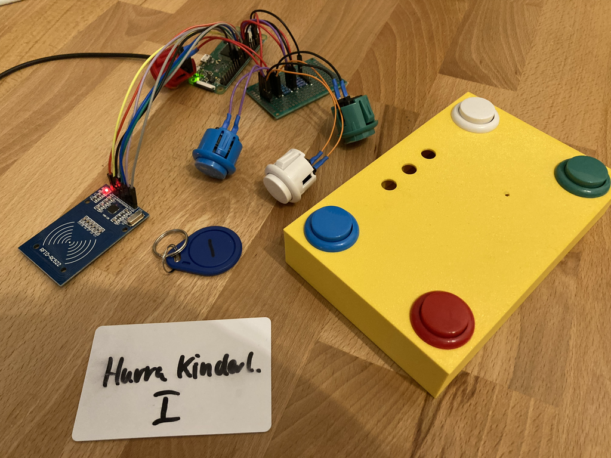

# Zero Music
A music player for kids controlled by RFID cards and colorful clicky buttons.
Streaming music to a Yamaha MusicCast speaker via Bluetooth has never been easier.



## Bill of material
- Raspberry Pi Zero W
- [RFID Reader Kit RC522](https://www.amazon.de/dp/B074S8MRQ7)
- [Arcade Buttons](https://www.amazon.de/dp/B075DCB7LT)
- Various Jumper Wires & Resistors (10k/1k)
- Perfboard

## Raspbian

Find the right image for your Raspberry: https://www.raspberrypi.com/software/operating-systems/
and follow along the headless configuration guide: https://www.raspberrypi.com/documentation/computers/configuration.html#setting-up-a-headless-raspberry-pi

```sh
# Change into Downloads folder
cd ~/Downloads
# curl OS Image
curl -OL "https://downloads.raspberrypi.org/raspios_lite_armhf/images/raspios_lite_armhf-2022-09-26/2022-09-22-raspios-bullseye-armhf-lite.img.xz"
# find the right disk (mine: /dev/disk4)
diskutil list
# unmount all volumes (mine: /dev/disk4)
diskutil umountDisk /dev/disk4
# this step requires xz package (see: brew)
# /dev/disk4 => /dev/rdisk4 faster imaging
xzcat "2022-09-22-raspios-bullseye-armhf-lite.img.xz" | dd of=/dev/rdisk4 bs=32M status=progress
# let's prepare our boot disk
cd /Volumes/boot
# Configure Networking
nano wpa_supplicant.conf
# Configure a User (generate PW with: openssl passwd -6)
nano userconf.txt
# Enable SSH Daemon
touch ssh
# unmount all volumes (mine: /dev/disk4)
diskutil umountDisk /dev/disk4
```

### First Boot

```sh
# Allow SSH Key for pi & root user
mkdir -p ~/.ssh/
echo "${SSH_KEY}" >> ~/.ssh/authorized_keys
# Test password-less connection with pi/root user
ssh -l pi <host>
ssh -l root <host>
# Filesystem should have been expanded automatically
# let's check with
df -h
# system updates
apt update && apt full-upgrade
# set hostname
hostnamectl set-hostname zero-music
sed -i 's/raspberrypi/zero-music/g' /etc/hosts
# Enable lingering for pi user
loginctl enable-linger pi
# Optional: fix your locales
sed -i 's/en_GB.UTF-8 UTF-8/# en_GB.UTF-8 UTF-8/g' /etc/locale.gen
sed -i 's/# en_US.UTF-8 UTF-8/en_US.UTF-8 UTF-8/g' /etc/locale.gen
locale-gen
# Optional: aliases
alias ll="ls -alh"
# Reboot
reboot
```

### Packages
- git
- mosquitto
- mosquitto-clients
- mpc
- mpd
- pulseaudio
- pulseaudio-module-bluetooth
- pulseaudio-utils
- python3-dbus
- python3-venv
- tree

## Pulse Audio
https://forum-raspberrypi.de/forum/thread/50427-mpd-mit-pulseaudio-und-bluetooth-raspi-os-lite/

```sh
pulseaudio -k
pulseaudio --start
```

- https://www.freedesktop.org/wiki/Software/PulseAudio/Documentation/

## mpd / mpc
- https://www.musicpd.org
- https://mpd.readthedocs.io/en/stable/user.html
- https://www.musicpd.org/doc/mpc/html/

## mosquitto

```sh
# whatch for all MQTT changes
mosquitto_sub -v -t "#"
```

## Zero Music

```sh
git clone https://github.com/jalmeroth/zero-music.git
```

### Python
```sh
# Change into zero-music folder
cd ~/zero-music
# give Python access to python3-dbus and others
python3 -m venv --system-site-packages .venv
# activate virtual environment
source ./.venv/bin/activate
# upgrade pip
pip install -U pip
# let's check for Python System Packages
pip list # dbus-python, RPu.GPIO, spidev
```

### Enable SPI

```sh
raspi-config
# 3. Interface Options
# I4 SPI Enable
```

### musiccast.py
Connects to your Yamaha MusicCast device and watches for status updates.

```sh
usage: musiccast.py [-h] [-d] [--mqtt-host MQTT_HOST] [--device-id DEVICE_ID] [--mac-addr MAC_ADDR] host

positional arguments:
  host                  Yamaha MusicCast Host

optional arguments:
  -h, --help            show this help message and exit
  -d                    Enable Debugging
  --mqtt-host MQTT_HOST
                        MQTT Host
  --device-id DEVICE_ID
                        Device ID
  --mac-addr MAC_ADDR   Device MAC Address
```

### controller.py

```sh
usage: controller.py [-h] [-d] [--mqtt-host MQTT_HOST] [--device-id DEVICE_ID] [--mac-addr MAC_ADDR] [--startup STARTUP] [--shutdown SHUTDOWN] [--play PLAY]

optional arguments:
  -h, --help            show this help message and exit
  -d                    Enable Debugging
  --mqtt-host MQTT_HOST
                        MQTT Host
  --device-id DEVICE_ID
                        Device ID
  --mac-addr MAC_ADDR   Device MAC Address
  --startup STARTUP     Startup script
  --shutdown SHUTDOWN   Shutdown script
  --play PLAY           Play music script
```

### dbus_watcher.py

```sh
usage: dbus_watcher.py [-h] [-d] [--mqtt-host MQTT_HOST] [--device-id DEVICE_ID] [--mac-addr MAC_ADDR]

optional arguments:
  -h, --help            show this help message and exit
  -d                    Enable Debugging
  --mqtt-host MQTT_HOST
                        MQTT Host
  --device-id DEVICE_ID
                        Device ID
  --mac-addr MAC_ADDR   Device MAC Address
```

```sh
busctl tree org.bluez
busctl introspect org.bluez /org/bluez/hci0
busctl introspect org.bluez /org/bluez/hci0/dev_XX_XX_YY_YY_ZZ_ZZ

dbus-monitor --system "type='signal',sender='org.bluez',path='/org/bluez/hci0/dev_XX_XX_YY_YY_ZZ_ZZ'"
```

- https://dbus.freedesktop.org/doc/dbus-specification.html
- https://git.kernel.org/pub/scm/bluetooth/bluez.git/tree/doc/device-api.txt
- https://github.com/RadiusNetworks/bluez/blob/master/doc/device-api.txt
- https://gitlab.freedesktop.org/dbus/dbus-python
- https://ukbaz.github.io/howto/python_gio_1.html
- https://stackoverflow.com/q/945007

### buttons.py

```sh
usage: buttons.py [-h] [-d] [--mqtt-host MQTT_HOST] [--device-id DEVICE_ID] [--mac-addr MAC_ADDR]

optional arguments:
  -h, --help            show this help message and exit
  -d                    Enable Debugging
  --mqtt-host MQTT_HOST
                        MQTT Host
  --device-id DEVICE_ID
                        Device ID
  --mac-addr MAC_ADDR   Device MAC Address
```

- https://pinout.xyz/

### tag_reader.py

```sh
usage: tag_reader.py [-h] [-d] [--mqtt-host MQTT_HOST] [--device-id DEVICE_ID] [--mac-addr MAC_ADDR]

optional arguments:
  -h, --help            show this help message and exit
  -d                    Enable Debugging
  --mqtt-host MQTT_HOST
                        MQTT Host
  --device-id DEVICE_ID
                        Device ID
  --mac-addr MAC_ADDR   Device MAC Address
```

Remember to enable SPI via `raspi-config`.

- https://github.com/ondryaso/pi-rc522

### systemd units

```sh
cd ~/zero-music/systemd
systemctl --user link $PWD/zero_*
systemctl --user status zero_music.service
systemctl --user enable --now $PWD/zero_*
```

- https://alesnosek.com/blog/2016/12/04/controlling-a-multi-service-application-with-systemd/